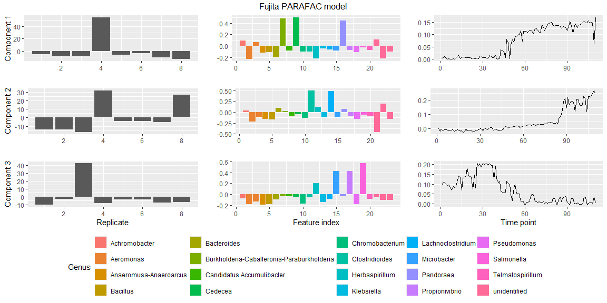

<!-- README.md is generated from README.Rmd. Please edit that file -->

# parafac4microbiome <a href="https://grvanderploeg.github.io/parafac4microbiome/"></a>

<!-- badges: start -->

[](https://app.codecov.io/gh/GRvanderPloeg/parafac4microbiome?branch=master)
[](https://github.com/GRvanderPloeg/parafac4microbiome/actions/workflows/R-CMD-check.yaml)
<!-- badges: end -->

## Overview

The `parafac4microbiome` package enables R users with an easy way to
create Parallel Factor Analysis (PARAFAC) models for longitudinal
microbiome data.

- `processDataCube()` can be used to process the microbiome count data
  appropriately for a multi-way data array.
- `parafac()` allows the user to create a Parallel Factor Analysis model
  of the multi-way data array.
- `assessModelQuality()` helps the user select the appropriate number of
  components by randomly initializing many PARAFAC models and inspecting
  various metrics of interest.
- `assessModelStability()` helps the user select the appropriate number
  of components by bootstrapping or jack-knifing samples and inspecting
  if the model outcome is similar.
- `plotPARAFACmodel()` helps visually inspect the PARAFAC model.

This package also comes with three example datasets.

- `Fujita2023`: an in-vitro experiment of ocean inocula on peptide
  medium, sampled every day for 110 days
  (<doi:10.1186/s40168-023-01474-5>).
- `Shao2019`: a large cohort dataset of vaginally and caesarean-section
  born infants from London (<doi:10.1038/s41586-019-1560-1>).
- `vanderPloeg2024`: a small gingivitis intervention dataset with
  response groups (<doi:10.1101/2024.03.18.585469>).

## Documentation

A basic introduction to the package is given in
`vignette("PARAFAC_introduction")` and modelling the example datasets
are elaborated in their respective vignettes
`vignette("Fujita2023_analysis")`, `vignette("Shao2019_analysis")` and
`vignette("vanderPloeg2024_analysis")`.

These vignettes and all function documentation can be found on the
GitHub pages website
[here](https://grvanderploeg.github.io/parafac4microbiome/).

## Installation

The `parafac4microbiome` package can be installed from CRAN using:

``` r
install.packages("parafac4microbiome")
```

## Development version

You can install the development version of `parafac4microbiome` from
[GitHub](https://github.com/) with:

``` r
# install.packages("devtools")
devtools::install_github("GRvanderPloeg/parafac4microbiome")
```

## Citation

Please use the following citation when using this package:

- van der Ploeg, G. R., Westerhuis, J., Heintz-Buschart, A., &
  Smilde, A. (2024). parafac4microbiome: Exploratory analysis of
  longitudinal microbiome data using Parallel Factor Analysis. bioRxiv,
  2024-05.

## Usage

``` r
library(parafac4microbiome)
set.seed(123)

# Process the data cube
processedFujita = processDataCube(Fujita2023,
                                  sparsityThreshold=0.99,
                                  CLR=TRUE,
                                  centerMode=1,
                                  scaleMode=2)

# Make a PARAFAC model
model = parafac(processedFujita$data, nfac=3, nstart=10, output="best", verbose=FALSE)

# Sign flip components to make figure interpretable and comparable to the paper.
# This has no effect on the model or the fit.
model$Fac[[1]][,2] = -1 * model$Fac[[1]][,2] # sign flip mode 1 component 2
model$Fac[[2]][,1] = -1 * model$Fac[[2]][,1] # sign flip mode 2 component 1
model$Fac[[2]][,3] = -1 * model$Fac[[2]][,3] # sign flip mode 2 component 3
model$Fac[[3]] = -1 * model$Fac[[3]]         # sign flip all of mode 3

# Plot the PARAFAC model using some metadata
plotPARAFACmodel(model$Fac, processedFujita,
                 numComponents = 3,
                 colourCols = c("", "Genus", ""),
                 legendTitles = c("", "Genus", ""),
                 xLabels = c("Replicate", "Feature index", "Time point"),
                 legendColNums = c(0,5,0),
                 arrangeModes = c(FALSE, TRUE, FALSE),
                 continuousModes = c(FALSE,FALSE,TRUE),
                 overallTitle = "Fujita PARAFAC model")
```



## Getting help

If you encounter an unexpected error or a clear bug, please file an
issue with a minimal reproducible example here on
[Github](https://github.com/GRvanderPloeg/parafac4microbiome/issues).
For questions or other types of feedback, feel free to send an email.
