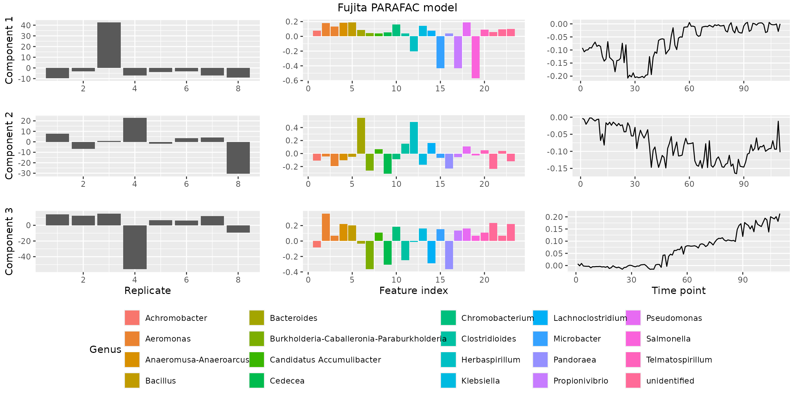

# Introduction

## Introduction

Welcome to the `parafac4microbiome` R package! In this vignette we
explain the datasets that available in this package, how you can model
them using PARAFAC, and how to plot the outcome. We require the
following packages and dependencies.

``` r

library(parafac4microbiome)
library(dplyr)
#> 
#> Attaching package: 'dplyr'
#> The following objects are masked from 'package:stats':
#> 
#>     filter, lag
#> The following objects are masked from 'package:base':
#> 
#>     intersect, setdiff, setequal, union
library(ggplot2)
```

## Datasets

The `parafac4microbiome` package comes with three exemplary datasets:
`Fujita2023`, `Shao2019` and `vanderPloeg2024`. These refer to the first
authors of their respective papers. Each of the dataset objects are
lists with the following contents:

- data: the data cube of microbiome counts.
- mode1: metadata corresponding to the subject mode.
- mode2: metadata corresponding to the feature (microbial abundances)
  mode.
- mode3: metadata corresponding to the time mode.

We briefly show what the data in these datasets look like and then focus
on `Fujita2023` for the remainder of this vignette. For details on the
datasets we refer to the parafac4microbiome paper and to the original
papers as listed in their respective help files. Modelling and selecting
the appropriate number components are explained in more detail in the
vignettes corresponding to each dataset:
[`vignette("Fujita2023")`](https://grvanderploeg.github.io/parafac4microbiome/articles/Fujita2023.md),
[`vignette("Shao2019")`](https://grvanderploeg.github.io/parafac4microbiome/articles/Shao2019.md)
and
[`vignette("vanderPloeg2024")`](https://grvanderploeg.github.io/parafac4microbiome/articles/vanderPloeg2024.md).

``` r

dim(Fujita2023$data)
#> [1]   8  28 110
dim(Shao2019$data)
#> [1] 395 959   4
dim(vanderPloeg2024$data)
#> NULL

# We focus on Fujita2023
head(Fujita2023$data[,,1])
#>       [,1] [,2] [,3] [,4] [,5] [,6] [,7] [,8] [,9] [,10] [,11] [,12] [,13]
#> [1,] 11932    0    0    0    0    0    0    0    0   113     0   161     0
#> [2,] 11532    0    0    0    0    0    0    0    0     0     0     0     0
#> [3,] 10331    0    0    0    0    0    0    0    0   236     0     0  1824
#> [4,] 11528    0    0    0    0    0    0    0    0     0     0     0     0
#> [5,] 13735    0    0    0    0    0    0    0    0   139     0     0     0
#> [6,]  9167    0    0    0    0    0    0    0    0   247     0     0     0
#>      [,14] [,15] [,16] [,17] [,18] [,19] [,20] [,21] [,22] [,23] [,24] [,25]
#> [1,]     0     0     0     0     0   719     0     0     0     0     0   230
#> [2,]     0     0     0     0     0     0     0    38     0     0     0     0
#> [3,]     0     0     0     0     0     0     0     0     0     0   162     0
#> [4,]     0     0     0     0     0     0     0     0     0     0     0     0
#> [5,]   217     0     0     0     0   239     0     0    67     0     0     0
#> [6,]     0     0     0     0     0     0     0     0     0     0     0     0
#>      [,26] [,27] [,28]
#> [1,]     0     0     0
#> [2,]     0     0   231
#> [3,]     0     0     0
#> [4,]     0     0     0
#> [5,]     0     0     0
#> [6,]     0     0     0
head(Fujita2023$mode1)
#> # A tibble: 6 × 1
#>   replicate.id
#>          <dbl>
#> 1            1
#> 2            2
#> 3            3
#> 4            4
#> 5            5
#> 6            6
head(Fujita2023$mode2)
#>       ID  Kingdom         Phylum               Class
#> 1 X_0002 Bacteria Proteobacteria Gammaproteobacteria
#> 2 X_0004 Bacteria     Firmicutes          Clostridia
#> 3 X_0007 Bacteria Proteobacteria Gammaproteobacteria
#> 4 X_0008 Bacteria Proteobacteria Gammaproteobacteria
#> 5 X_0010 Bacteria Proteobacteria Gammaproteobacteria
#> 6 X_0015 Bacteria     Firmicutes          Clostridia
#>                                 Order                Family
#> 1                       Aeromonadales        Aeromonadaceae
#> 2 Peptostreptococcales-Tissierellales Peptostreptococcaceae
#> 3                     Burkholderiales      Burkholderiaceae
#> 4                     Burkholderiales      Burkholderiaceae
#> 5                    Enterobacterales          unidentified
#> 6                      Lachnospirales       Lachnospiraceae
#>                                        Genus      Species
#> 1                                  Aeromonas unidentified
#> 2                             Clostridioides   mangenotii
#> 3                                  Pandoraea unidentified
#> 4 Burkholderia-Caballeronia-Paraburkholderia unidentified
#> 5                               unidentified unidentified
#> 6                          Lachnoclostridium unidentified
head(Fujita2023$mode3)
#> # A tibble: 6 × 1
#>    time
#>   <dbl>
#> 1     1
#> 2     2
#> 3     3
#> 4     4
#> 5     5
#> 6     6
```

## Analysis

### Processing the data cube

As shown above, the data cube in `Fujita2023$data` contains unprocessed
counts. The function
[`processDataCube()`](https://grvanderploeg.github.io/parafac4microbiome/reference/processDataCube.md)
performs the processing of these counts with the following steps:

- It performs feature selection based on the sparsityThreshold setting.
  Sparsity is here defined as the fraction of samples where a microbial
  abundance (ASV/OTU or otherwise) is zero.
- It performs a centered log-ratio transformation of each sample using
  the
  [`compositions::clr()`](https://rdrr.io/pkg/compositions/man/clr.html)
  function with a pseudo-count of one (on all features, prior to
  selection based on sparsity).
- It centers and scales the three-way array. This is a complex subject,
  for which we refer to a [paper by Rasmus Bro and Age
  Smilde](https://doi.org/10.1002/cem.773). By centering across the
  subject mode, we make the subjects comparable to each other within
  each time point. Scaling within the feature mode avoids the PARAFAC
  model focusing on features with abnormally high variation.

The outcome of processing is a new version of the dataset. Please refer
to the documentation of
[`processDataCube()`](https://grvanderploeg.github.io/parafac4microbiome/reference/processDataCube.md)
for more information.

``` r

processedFujita = processDataCube(Fujita2023, sparsityThreshold=0.99, CLR=TRUE, centerMode=1, scaleMode=2)
head(processedFujita$data[,,1])
#>         [,1]   [,2]    [,3]    [,4]    [,5]   [,6]    [,7]    [,8]   [,9]
#> [1,] -0.5098 -0.265 -0.2669 -0.2743 -0.3655 -0.562 -0.2923 -0.5410 -0.890
#> [2,]  0.0763  0.017  0.0171  0.0176  0.0234  0.036  0.0187  0.0346  0.057
#> [3,] -0.5155 -0.179 -0.1797 -0.1847 -0.2461 -0.378 -0.1969 -0.3644 -0.600
#> [4,]  0.5277  0.218  0.2197  0.2258  0.3008  0.462  0.2406  0.4454  0.733
#> [5,] -0.2311 -0.228 -0.2296 -0.2359 -0.3144 -0.483 -0.2514 -0.4653 -0.766
#> [6,] -0.0526  0.102  0.1022  0.1050  0.1399  0.215  0.1119  0.2071  0.341
#>       [,10]  [,11]  [,12]  [,13]  [,14]   [,15]   [,16] [,17]   [,18]  [,19]
#> [1,]  0.544 -0.862 -1.703 -0.495 -0.672 -0.4608 -0.2023  9.04 -0.9420 -1.199
#> [2,] -0.805 -0.575 -0.998 -0.272  0.043  0.0295  0.0130 -2.88  0.0603  4.373
#> [3,]  0.818  3.962 -1.487 -0.427 -0.453 -0.3104 -0.1363 -3.50 -0.6344 -1.010
#> [4,] -0.703 -0.369 -0.495 -0.114  0.553  0.3793  0.1666 -2.25  0.7754 -0.142
#> [5,]  0.627 -0.824  6.713 -0.466 -0.578 -0.3964 -0.1740  7.02 -0.8102 -1.118
#> [6,]  0.975 -0.488 -0.787 -0.206  0.257  0.1764  0.0775 -2.62  0.3607 -0.398
#>        [,20]  [,21]   [,22]   [,23]
#> [1,] -0.3990 10.070 -0.6812 -0.7411
#> [2,]  0.0255 -1.517  0.0436  0.0474
#> [3,] -0.2687 -2.252 -0.4588 -0.4991
#> [4,]  0.3285 -0.761  0.5608  0.6100
#> [5,] -0.3432 -2.438 -0.5860 -0.6374
#> [6,]  0.1528 -1.200  0.2608  0.2837
```

### Making a PARAFAC model

The processed data is ready to be modeled using Parallel Factor
Analysis. Here we arbitrarily set the number of factors (i.e. the number
of components) to be three. This is normally the outcome of a more
detailed investigation into the correct number of components, described
in
[`vignette("Fujita2023")`](https://grvanderploeg.github.io/parafac4microbiome/articles/Fujita2023.md),
[`vignette("Shao2019")`](https://grvanderploeg.github.io/parafac4microbiome/articles/Shao2019.md)
and
[`vignette("vanderPloeg2024")`](https://grvanderploeg.github.io/parafac4microbiome/articles/vanderPloeg2024.md).
The output of the function is a list object containing the PARAFAC
loadings in each mode in `model$Fac` and some statistics like R-squared
and the sum of squared error.

``` r

set.seed(0) # for reproducibility
model = parafac(processedFujita$data, nfac=3)

head(model$Fac[[1]])
#>       [,1]   [,2]   [,3]
#> [1,] -9.49  7.589  13.76
#> [2,] -3.29 -6.672  12.05
#> [3,] 42.62  0.897  14.94
#> [4,] -7.12 22.768 -56.08
#> [5,] -3.77 -1.796   6.51
#> [6,] -3.14  3.563   6.27
head(model$Fac[[2]])
#>        [,1]    [,2]   [,3]
#> [1,] 0.1800 -0.0471  0.355
#> [2,] 0.0414  0.1492 -0.250
#> [3,] 0.0406 -0.2300 -0.366
#> [4,] 0.0452 -0.2641 -0.365
#> [5,] 0.0566 -0.2339  0.234
#> [6,] 0.0783  0.1625 -0.287
head(model$Fac[[3]])
#>         [,1]     [,2]     [,3]
#> [1,] -0.0920 -0.00324  0.00684
#> [2,] -0.1070 -0.00689 -0.00118
#> [3,] -0.1003 -0.02077  0.00856
#> [4,] -0.0997 -0.01231 -0.00195
#> [5,] -0.0911 -0.00229 -0.00277
#> [6,] -0.0924 -0.00237 -0.00319
model$varExp
#> [1] 38.1
```

This model explains 38.113 percent of the variation in the processed
data cube.

### Plotting a PARAFAC model

The
[`plotPARAFACmodel()`](https://grvanderploeg.github.io/parafac4microbiome/reference/plotPARAFACmodel.md)
function gives the user full control over how they want to visualize
their model. As such, there are a lot of plotting options that can be
used, which you can see below. A brief overview:

- colourCols: per mode (subject, feature, time), specifies by what
  variable the loading bar plot should be colored.
- legendTitles: titles of the legends per mode, if colourCode is not
  specified for a mode, a legend will not be generated.
- xLabels: labels for the x axis of each mode.
- legendColNums: the number of columns in the legend for each mode. If
  colourCode is not specified for a mode, a legend will not be
  generated.
- arrangeModes: a vector of boolean values specifying if the loadings
  should be grouped by their colourCol for easier inspection.
- continuousModes: a vector of boolean values specifying if the loadings
  should be visualized with a line plot instead of the default bar plot.
- overallTitle: title of the plot.

For a full overview, please refer to the documentation of
[`plotPARAFACmodel()`](https://grvanderploeg.github.io/parafac4microbiome/reference/plotPARAFACmodel.md).

``` r

plotPARAFACmodel(model$Fac, processedFujita,
  numComponents = 3,
  colourCols = c("", "Genus", ""),
  legendTitles = c("", "Genus", ""),
  xLabels = c("Replicate", "Feature index", "Time point"),
  legendColNums = c(0,5,0),
  arrangeModes = c(FALSE, TRUE, FALSE),
  continuousModes = c(FALSE,FALSE,TRUE),
  overallTitle = "Fujita PARAFAC model")
```



This concludes the introduction to the `parafac4microbiome` package. We
hope this gives you sufficient information to get started. For more
details on modelling specific datasets, please refer to
[`vignette("Fujita2023")`](https://grvanderploeg.github.io/parafac4microbiome/articles/Fujita2023.md),
[`vignette("Shao2019")`](https://grvanderploeg.github.io/parafac4microbiome/articles/Shao2019.md)
and
[`vignette("vanderPloeg2024")`](https://grvanderploeg.github.io/parafac4microbiome/articles/vanderPloeg2024.md).
